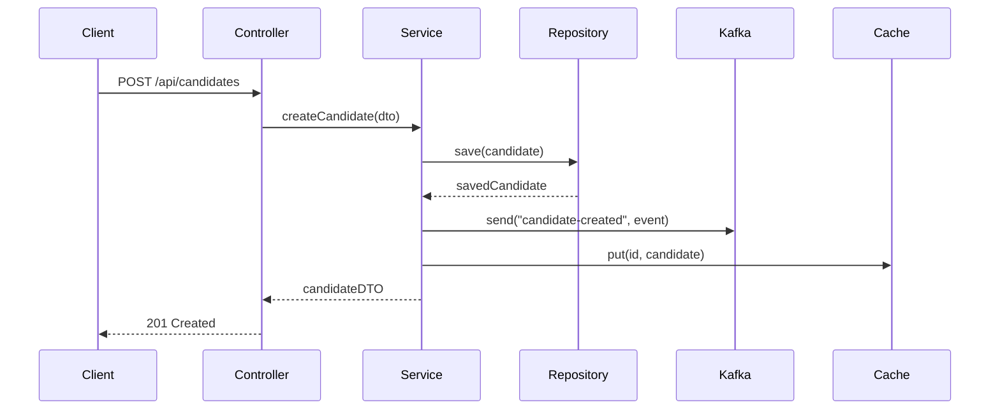
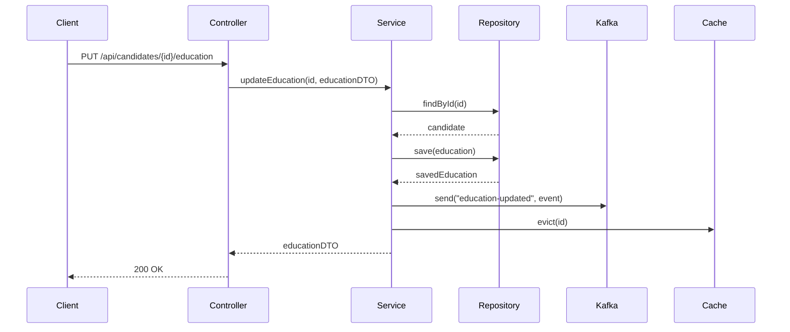
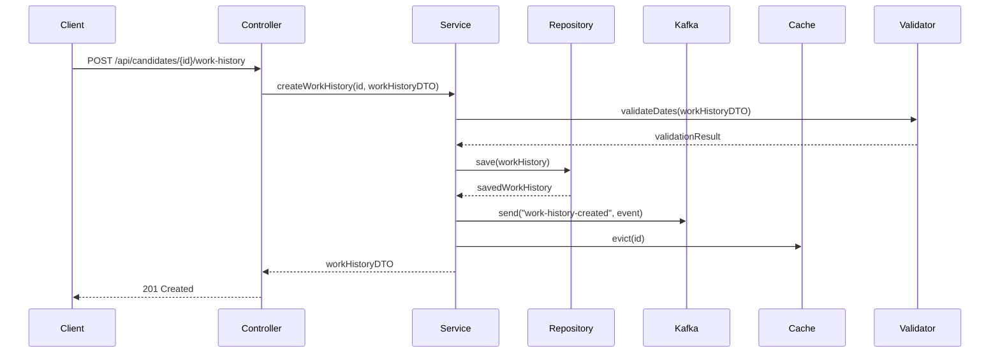
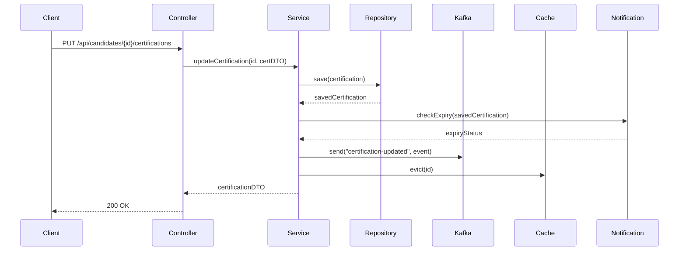

# HCM Candidate Microservice - Technical Documentation

## Table of Contents
- [Architecture Overview](#architecture-overview)
- [Core Components](#core-components)
- [Database Design](#database-design)
- [API Design](#api-design)
- [Event-Driven Architecture](#event-driven-architecture)
- [Security Implementation](#security-implementation)
- [Performance Optimizations](#performance-optimizations)
- [Error Handling](#error-handling)
- [Testing Strategy](#testing-strategy)
- [Monitoring and Observability](#monitoring-and-observability)

## Architecture Overview

### System Architecture
```
┌─────────────────┐     ┌─────────────────┐     ┌─────────────────┐
│   API Gateway   │────▶│  Load Balancer  │────▶│  Candidate MS   │
└─────────────────┘     └─────────────────┘     └─────────────────┘
                                                         │
                                                         ▼
┌─────────────────┐     ┌─────────────────┐     ┌─────────────────┐
│   Monitoring    │◀───▶│    Database     │◀────│    Kafka MS     │
└─────────────────┘     └─────────────────┘     └─────────────────┘
```

### Technology Stack
- **Runtime**: Java 17
- **Framework**: Spring Boot 3.x
- **Database**: PostgreSQL 14+
- **Message Broker**: Kafka 3.x
- **Database Migration**: Liquibase
- **ORM**: JPA/Hibernate
- **Build Tool**: Maven
- **Testing**: JUnit 5, Mockito
- **Containerization**: Docker
- **Orchestration**: Kubernetes

## Core Components

### 1. Service Layer
```java
@Service
@Slf4j
public class CandidateService {
    private final CandidateRepository candidateRepository;
    private final KafkaTemplate<String, Object> kafkaTemplate;
    private final CacheManager cacheManager;

    @Autowired
    public CandidateService(CandidateRepository candidateRepository,
                          KafkaTemplate<String, Object> kafkaTemplate,
                          CacheManager cacheManager) {
        this.candidateRepository = candidateRepository;
        this.kafkaTemplate = kafkaTemplate;
        this.cacheManager = cacheManager;
    }

    @Transactional(isolation = Isolation.READ_COMMITTED)
    @Retryable(value = OptimisticLockingFailureException.class, maxAttempts = 3)
    public CandidateDTO createCandidate(CandidateDTO dto) {
        log.info("Creating candidate: {}", dto);
        
        Candidate candidate = new Candidate();
        BeanUtils.copyProperties(dto, candidate);
        
        Candidate savedCandidate = candidateRepository.save(candidate);
        
        // Publish event
        kafkaTemplate.send("candidate-created", 
            new CandidateEvent("CANDIDATE_CREATED", savedCandidate));
        
        // Update cache
        cacheManager.getCache("candidates").put(savedCandidate.getId(), savedCandidate);
        
        return convertToDTO(savedCandidate);
    }

    @Cacheable(value = "candidates", key = "#id")
    public CandidateDTO getCandidate(UUID id) {
        return candidateRepository.findById(id)
            .map(this::convertToDTO)
            .orElseThrow(() -> new CandidateNotFoundException(id));
    }

    private CandidateDTO convertToDTO(Candidate candidate) {
        CandidateDTO dto = new CandidateDTO();
        BeanUtils.copyProperties(candidate, dto);
        return dto;
    }
}
```

#### Key Features:
- Transaction management with `@Transactional`
- Optimistic locking with `@Version`
- Retry mechanism with `@Retryable`
- Event publishing with Kafka

### 2. Repository Layer
```java
@Repository
public interface CandidateRepository extends JpaRepository<Candidate, UUID> {
    @Query("SELECT c FROM Candidate c WHERE c.email = :email")
    Optional<Candidate> findByEmail(@Param("email") String email);

    @Query(value = "SELECT * FROM hcm.candidate WHERE created_date >= :startDate", 
           nativeQuery = true)
    Page<Candidate> findRecentCandidates(@Param("startDate") LocalDateTime startDate, 
                                        Pageable pageable);

    @Query("SELECT c FROM Candidate c LEFT JOIN FETCH c.education WHERE c.id = :id")
    Optional<Candidate> findByIdWithEducation(@Param("id") UUID id);

    @Modifying
    @Query("UPDATE Candidate c SET c.status = :status WHERE c.id = :id")
    int updateStatus(@Param("id") UUID id, @Param("status") String status);
}
```

#### Features:
- JPA repository pattern
- Custom query methods
- Query optimization
- Pagination support

### 3. Controller Layer
```java
@RestController
@RequestMapping("/api/candidates")
@Validated
public class CandidateController {
    private final CandidateService candidateService;
    private final ObjectMapper objectMapper;

    @PostMapping
    @ResponseStatus(HttpStatus.CREATED)
    public ResponseEntity<CandidateDTO> createCandidate(
            @Valid @RequestBody CandidateDTO dto) {
        return ResponseEntity.ok(candidateService.createCandidate(dto));
    }

    @GetMapping("/{id}")
    public ResponseEntity<CandidateDTO> getCandidate(@PathVariable UUID id) {
        return ResponseEntity.ok(candidateService.getCandidate(id));
    }

    @ExceptionHandler(CandidateNotFoundException.class)
    public ResponseEntity<ErrorResponse> handleCandidateNotFound(
            CandidateNotFoundException ex) {
        ErrorResponse error = new ErrorResponse(
            "CANDIDATE_NOT_FOUND",
            ex.getMessage(),
            LocalDateTime.now()
        );
        return ResponseEntity.status(HttpStatus.NOT_FOUND).body(error);
    }
}
```

#### Features:
- RESTful API design
- Request validation
- Response standardization
- Error handling

## Database Design

### Schema Design
```sql
-- Core tables
CREATE TABLE hcm.candidate (
    candidate_id UUID PRIMARY KEY,
    first_name VARCHAR(255),
    last_name VARCHAR(255),
    email VARCHAR(255) UNIQUE,
    -- Other fields
);

-- Audit columns
CREATE TABLE hcm.audit_columns (
    created_by VARCHAR(255),
    created_date TIMESTAMP,
    last_modified_by VARCHAR(255),
    last_modified_date TIMESTAMP,
    version BIGINT
);
```

### Indexing Strategy
```sql
-- Primary indexes
CREATE INDEX idx_candidate_email ON hcm.candidate(email);
CREATE INDEX idx_candidate_name ON hcm.candidate(last_name, first_name);

-- Foreign key indexes
CREATE INDEX idx_education_candidate ON hcm.candidate_education(candidate_id);
CREATE INDEX idx_work_candidate ON hcm.candidate_work_history(candidate_id);
```

### Data Access Patterns
1. **Read Operations**:
   - Eager loading for single-record fetches
   - Lazy loading for collections
   - Pagination for large result sets

2. **Write Operations**:
   - Optimistic locking
   - Batch processing
   - Transaction management

## API Design

### RESTful Endpoints
```
GET    /api/candidates           - List candidates
POST   /api/candidates           - Create candidate
GET    /api/candidates/{id}      - Get candidate
PUT    /api/candidates/{id}      - Update candidate
DELETE /api/candidates/{id}      - Delete candidate
```

### Request/Response Format
```json
// Request
{
    "firstName": "John",
    "lastName": "Doe",
    "email": "john.doe@example.com"
}

// Response
{
    "id": "uuid",
    "firstName": "John",
    "lastName": "Doe",
    "email": "john.doe@example.com",
    "createdDate": "2024-03-20T10:00:00Z"
}
```

### Error Handling
```json
{
    "timestamp": "2024-03-20T10:00:00Z",
    "status": 400,
    "error": "Bad Request",
    "message": "Validation failed",
    "path": "/api/candidates"
}
```

## Event-Driven Architecture

### Sequence Diagrams

#### 1. Candidate Creation Flow


#### 2. Education History Update Flow


#### 3. Work History Creation Flow


#### 4. Certification Update Flow


## Advanced Performance Tuning

### 1. Database Performance Scenarios

#### High-Volume Read Operations
```sql
-- Partitioning Strategy
CREATE TABLE hcm.candidate (
    candidate_id UUID,
    created_date TIMESTAMP,
    -- other columns
) PARTITION BY RANGE (created_date);

-- Create partitions
CREATE TABLE hcm.candidate_y2024m01 PARTITION OF hcm.candidate
    FOR VALUES FROM ('2024-01-01') TO ('2024-02-01');

-- Index Strategy
CREATE INDEX idx_candidate_created_date ON hcm.candidate(created_date);
CREATE INDEX idx_candidate_email_created ON hcm.candidate(email, created_date);

-- Query Optimization
EXPLAIN ANALYZE
SELECT c.*, e.*
FROM hcm.candidate c
LEFT JOIN hcm.candidate_education e ON c.candidate_id = e.candidate_id
WHERE c.created_date >= '2024-01-01'
  AND c.created_date < '2024-02-01';
```

#### Batch Processing
```java
@Service
public class CandidateBatchService {
    @Transactional
    public void processBatch(List<CandidateDTO> candidates) {
        int batchSize = 100;
        Lists.partition(candidates, batchSize).forEach(batch -> {
            List<Candidate> entities = batch.stream()
                .map(this::convertToEntity)
                .collect(Collectors.toList());
            candidateRepository.saveAll(entities);
        });
    }
}
```

### 2. JVM Performance Scenarios

#### Memory-Intensive Operations
```bash
# JVM Options for Memory-Intensive Workloads
java -Xms4g -Xmx4g \
     -XX:+UseG1GC \
     -XX:MaxGCPauseMillis=200 \
     -XX:InitiatingHeapOccupancyPercent=35 \
     -XX:G1HeapRegionSize=16M \
     -XX:G1ReservePercent=15 \
     -XX:SurvivorRatio=8 \
     -XX:MaxTenuringThreshold=15 \
     -jar candidate-service.jar
```

#### High-Concurrency Scenarios
```properties
# Thread Pool Configuration
app.thread-pool.core-size=20
app.thread-pool.max-size=40
app.thread-pool.queue-capacity=1000
app.thread-pool.keep-alive-seconds=60

# Connection Pool Tuning
spring.datasource.hikari.maximum-pool-size=30
spring.datasource.hikari.minimum-idle=10
spring.datasource.hikari.connection-timeout=30000
```

### 3. Kafka Performance Scenarios

#### High-Throughput Producer
```java
@Configuration
public class KafkaProducerConfig {
    @Bean
    public ProducerFactory<String, Object> producerFactory() {
        Map<String, Object> config = new HashMap<>();
        config.put(ProducerConfig.BOOTSTRAP_SERVERS_CONFIG, "localhost:9092");
        config.put(ProducerConfig.KEY_SERIALIZER_CLASS_CONFIG, StringSerializer.class);
        config.put(ProducerConfig.VALUE_SERIALIZER_CLASS_CONFIG, JsonSerializer.class);
        config.put(ProducerConfig.BATCH_SIZE_CONFIG, 16384);
        config.put(ProducerConfig.LINGER_MS_CONFIG, 5);
        config.put(ProducerConfig.COMPRESSION_TYPE_CONFIG, "snappy");
        config.put(ProducerConfig.ACKS_CONFIG, "1");
        return new DefaultKafkaProducerFactory<>(config);
    }
}
```

#### Consumer Performance
```java
@Configuration
public class KafkaConsumerConfig {
    @Bean
    public ConsumerFactory<String, Object> consumerFactory() {
        Map<String, Object> config = new HashMap<>();
        config.put(ConsumerConfig.BOOTSTRAP_SERVERS_CONFIG, "localhost:9092");
        config.put(ConsumerConfig.GROUP_ID_CONFIG, "candidate-group");
        config.put(ConsumerConfig.KEY_DESERIALIZER_CLASS_CONFIG, StringDeserializer.class);
        config.put(ConsumerConfig.VALUE_DESERIALIZER_CLASS_CONFIG, JsonDeserializer.class);
        config.put(ConsumerConfig.MAX_POLL_RECORDS_CONFIG, 500);
        config.put(ConsumerConfig.FETCH_MIN_BYTES_CONFIG, 1);
        config.put(ConsumerConfig.FETCH_MAX_WAIT_MS_CONFIG, 500);
        return new DefaultKafkaConsumerFactory<>(config);
    }
}
```

## Comprehensive Troubleshooting Guide

### 1. Database Issues

#### Connection Pool Exhaustion
```java
// Symptoms
- "HikariPool-1 - Connection is not available, request timed out after 30000ms"
- High response times
- Connection pool metrics showing full pool

// Solution
1. Check connection pool settings
2. Monitor active connections
3. Implement connection timeout
4. Add connection pool metrics

// Prevention
- Implement circuit breaker
- Add connection pool monitoring
- Set up alerts for pool exhaustion
- Regular pool health checks
```

#### Deadlocks
```sql
-- Identify deadlocks
SELECT blocked_locks.pid AS blocked_pid,
       blocked_activity.usename AS blocked_user,
       blocking_locks.pid AS blocking_pid,
       blocking_activity.usename AS blocking_user,
       blocked_activity.query AS blocked_statement
FROM pg_catalog.pg_locks blocked_locks
JOIN pg_catalog.pg_stat_activity blocked_activity ON blocked_activity.pid = blocked_locks.pid
JOIN pg_catalog.pg_locks blocking_locks 
    ON blocking_locks.locktype = blocked_locks.locktype
    AND blocking_locks.DATABASE IS NOT DISTINCT FROM blocked_locks.DATABASE
    AND blocking_locks.relation IS NOT DISTINCT FROM blocked_locks.relation
    AND blocking_locks.page IS NOT DISTINCT FROM blocked_locks.page
    AND blocking_locks.tuple IS NOT DISTINCT FROM blocked_locks.tuple
    AND blocking_locks.virtualxid IS NOT DISTINCT FROM blocked_locks.virtualxid
    AND blocking_locks.transactionid IS NOT DISTINCT FROM blocked_locks.transactionid
    AND blocking_locks.classid IS NOT DISTINCT FROM blocked_locks.classid
    AND blocking_locks.objid IS NOT DISTINCT FROM blocked_locks.objid
    AND blocking_locks.objsubid IS NOT DISTINCT FROM blocked_locks.objsubid
    AND blocking_locks.pid != blocked_locks.pid
JOIN pg_catalog.pg_stat_activity blocking_activity ON blocking_activity.pid = blocking_locks.pid
WHERE NOT blocked_locks.GRANTED;
```

### 2. Memory Issues

#### Memory Leaks
```java
// Symptoms
- Increasing memory usage
- Frequent GC
- OutOfMemoryError

// Solution
1. Enable heap dumps
2. Analyze with MAT or VisualVM
3. Check for resource leaks
4. Monitor object creation

// Prevention
- Regular memory profiling
- Set up memory alerts
- Implement memory monitoring
- Regular code reviews for resource management
```

#### GC Issues
```bash
# GC Log Analysis
java -XX:+PrintGCDetails \
     -XX:+PrintGCDateStamps \
     -Xloggc:gc.log \
     -jar candidate-service.jar

# GC Log Analysis Tool
gceasy -f gc.log

# GC Tuning for Different Scenarios
# 1. Low Latency
-XX:+UseG1GC -XX:MaxGCPauseMillis=50

# 2. High Throughput
-XX:+UseParallelGC -XX:ParallelGCThreads=4

# 3. Memory Efficiency
-XX:+UseConcMarkSweepGC -XX:CMSInitiatingOccupancyFraction=70
```

### 3. Kafka Issues

#### Consumer Lag
```java
// Symptoms
- Increasing consumer lag
- Delayed event processing
- High latency

// Solution
1. Monitor consumer lag
2. Adjust consumer threads
3. Check consumer group
4. Verify partition count

// Prevention
- Set up lag monitoring
- Implement auto-scaling
- Regular partition rebalancing
- Consumer health checks
```

#### Producer Issues
```java
// Symptoms
- Failed message delivery
- High latency
- Connection issues

// Solution
1. Check producer configs
2. Monitor broker health
3. Verify network
4. Check message size

// Prevention
- Implement retry mechanism
- Set up producer monitoring
- Regular broker health checks
- Message size validation
```

### 4. Application Issues

#### High Response Times
```java
// Symptoms
- Slow API responses
- Timeout errors
- Resource exhaustion

// Solution
1. Profile application
2. Check thread pools
3. Monitor resource usage
4. Review caching strategy

// Prevention
- Implement response time monitoring
- Set up performance alerts
- Regular performance testing
- Cache optimization
```

#### Circuit Breaker Trips
```java
// Symptoms
- Circuit breaker open
- Service degradation
- Cascading failures

// Solution
1. Check downstream services
2. Review circuit breaker config
3. Monitor failure rates
4. Implement fallbacks

// Prevention
- Set up circuit breaker monitoring
- Implement graceful degradation
- Regular health checks
- Service dependency mapping
```

### 5. Security Issues

#### Authentication Failures
```java
// Symptoms
- Failed login attempts
- Token validation errors
- Session timeouts

// Solution
1. Check authentication config
2. Verify token validity
3. Review session management
4. Check user credentials

// Prevention
- Implement rate limiting
- Set up security monitoring
- Regular security audits
- Token rotation
```

#### Authorization Issues
```java
// Symptoms
- Access denied errors
- Permission issues
- Role conflicts

// Solution
1. Check role assignments
2. Verify permissions
3. Review access policies
4. Check user roles

// Prevention
- Regular permission audits
- Role-based access control
- Access logging
- Security monitoring
```

## Monitoring and Alerts

### 1. Key Metrics
```yaml
# Prometheus Metrics
- http_server_requests_seconds_count
- jvm_memory_used_bytes
- hikaricp_connections_active
- kafka_consumer_lag
- circuit_breaker_state
```

### 2. Alert Rules
```yaml
# Prometheus Alert Rules
groups:
- name: candidate-service
  rules:
  - alert: HighErrorRate
    expr: rate(http_server_requests_seconds_count{status=~"5.."}[5m]) > 0.1
    for: 5m
    labels:
      severity: critical
    annotations:
      summary: High error rate detected
      description: Error rate is {{ $value }} for the last 5 minutes

  - alert: HighLatency
    expr: http_server_requests_seconds{quantile="0.9"} > 1
    for: 5m
    labels:
      severity: warning
    annotations:
      summary: High latency detected
      description: 90th percentile latency is {{ $value }}s
```

### 3. Logging Strategy
```java
@Slf4j
public class CandidateService {
    public CandidateDTO createCandidate(CandidateDTO dto) {
        MDC.put("candidateId", dto.getId().toString());
        log.info("Starting candidate creation");
        try {
            // Implementation
            log.info("Candidate created successfully");
            return result;
        } catch (Exception e) {
            log.error("Failed to create candidate", e);
            throw e;
        } finally {
            MDC.clear();
        }
    }
}
```

### Tracing
```java
@Configuration
public class TracingConfig {
    @Bean
    public Tracer tracer() {
        // Tracing configuration
    }
}
```

## Best Practices

### Code Organization
- Package structure
- Naming conventions
- Code style
- Documentation

### Development Workflow
- Branch strategy
- Code review process
- Testing requirements
- Deployment process

### Performance Guidelines
- Response time targets
- Resource utilization
- Scalability considerations
- Monitoring requirements

### Security Guidelines
- Authentication requirements
- Authorization rules
- Data protection
- Security testing

## Future Considerations

### Scalability
- Horizontal scaling
- Vertical scaling
- Database sharding
- Caching strategies

### Maintainability
- Code refactoring
- Technical debt
- Documentation updates
- Performance optimization

### Security
- Security updates
- Vulnerability scanning
- Penetration testing
- Compliance requirements

## Performance Tuning Guidelines

### 1. Database Optimization
```sql
-- Query Optimization
EXPLAIN ANALYZE SELECT * FROM hcm.candidate 
WHERE email = 'john.doe@example.com';

-- Index Usage
CREATE INDEX idx_candidate_composite ON hcm.candidate(last_name, first_name, email);

-- Partitioning
CREATE TABLE hcm.candidate (
    -- columns
) PARTITION BY RANGE (created_date);

-- Statistics Update
ANALYZE hcm.candidate;
```

### 2. JVM Tuning
```bash
# Production JVM Options
java -Xms2g -Xmx2g \
     -XX:+UseG1GC \
     -XX:MaxGCPauseMillis=200 \
     -XX:+UseStringDeduplication \
     -XX:+HeapDumpOnOutOfMemoryError \
     -XX:HeapDumpPath=/var/log/heapdump.hprof \
     -XX:+PrintGCDetails \
     -XX:+PrintGCDateStamps \
     -Xloggc:/var/log/gc.log \
     -jar candidate-service.jar
```

### 3. Connection Pool Tuning
```properties
# HikariCP Configuration
spring.datasource.hikari.maximum-pool-size=20
spring.datasource.hikari.minimum-idle=5
spring.datasource.hikari.idle-timeout=300000
spring.datasource.hikari.connection-timeout=20000
spring.datasource.hikari.max-lifetime=1200000
```

## Troubleshooting Guide

### 1. Database Issues

#### Connection Pool Exhaustion
```java
// Symptoms
- "HikariPool-1 - Connection is not available, request timed out after 30000ms"
- High response times
- Connection pool metrics showing full pool

// Solution
1. Check connection pool settings
2. Monitor active connections
3. Implement connection timeout
4. Add connection pool metrics
```

#### Slow Queries
```sql
-- Identify slow queries
SELECT query, calls, total_time, mean_time
FROM pg_stat_statements
ORDER BY mean_time DESC
LIMIT 10;

-- Check index usage
SELECT schemaname, tablename, indexname, idx_scan
FROM pg_stat_user_indexes
ORDER BY idx_scan DESC;
```

### 2. Memory Issues

#### Memory Leaks
```java
// Symptoms
- Increasing memory usage
- Frequent GC
- OutOfMemoryError

// Solution
1. Enable heap dumps
2. Analyze with MAT or VisualVM
3. Check for resource leaks
4. Monitor object creation
```

#### GC Tuning
```bash
# GC Log Analysis
java -XX:+PrintGCDetails \
     -XX:+PrintGCDateStamps \
     -Xloggc:gc.log \
     -jar candidate-service.jar

# GC Log Analysis Tool
gceasy -f gc.log
```

### 3. Kafka Issues

#### Consumer Lag
```java
// Symptoms
- Increasing consumer lag
- Delayed event processing
- High latency

// Solution
1. Monitor consumer lag
2. Adjust consumer threads
3. Check consumer group
4. Verify partition count
```

#### Producer Issues
```java
// Symptoms
- Failed message delivery
- High latency
- Connection issues

// Solution
1. Check producer configs
2. Monitor broker health
3. Verify network
4. Check message size
```

### 4. Application Issues

#### High Response Times
```java
// Symptoms
- Slow API responses
- Timeout errors
- Resource exhaustion

// Solution
1. Profile application
2. Check thread pools
3. Monitor resource usage
4. Review caching strategy
```

#### Circuit Breaker Trips
```java
// Symptoms
- Circuit breaker open
- Service degradation
- Cascading failures

// Solution
1. Check downstream services
2. Review circuit breaker config
3. Monitor failure rates
4. Implement fallbacks
```

## Monitoring and Alerts

### 1. Key Metrics
```yaml
# Prometheus Metrics
- http_server_requests_seconds_count
- jvm_memory_used_bytes
- hikaricp_connections_active
- kafka_consumer_lag
- circuit_breaker_state
```

### 2. Alert Rules
```yaml
# Prometheus Alert Rules
groups:
- name: candidate-service
  rules:
  - alert: HighErrorRate
    expr: rate(http_server_requests_seconds_count{status=~"5.."}[5m]) > 0.1
    for: 5m
    labels:
      severity: critical
    annotations:
      summary: High error rate detected
      description: Error rate is {{ $value }} for the last 5 minutes

  - alert: HighLatency
    expr: http_server_requests_seconds{quantile="0.9"} > 1
    for: 5m
    labels:
      severity: warning
    annotations:
      summary: High latency detected
      description: 90th percentile latency is {{ $value }}s
```

### 3. Logging Strategy
```java
@Slf4j
public class CandidateService {
    public CandidateDTO createCandidate(CandidateDTO dto) {
        MDC.put("candidateId", dto.getId().toString());
        log.info("Starting candidate creation");
        try {
            // Implementation
            log.info("Candidate created successfully");
            return result;
        } catch (Exception e) {
            log.error("Failed to create candidate", e);
            throw e;
        } finally {
            MDC.clear();
        }
    }
}
``` 